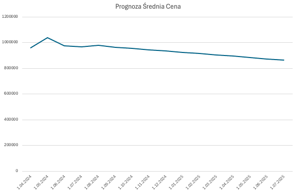

# Machine Learning (ML) - Ceny mieszkań Warszawa

## Model (ML) regresji liniowej (linear regression) w BigQuery przewidujący ceny mieszkań w Warszawie na podstawie danych zescrapowanych z serwisu otodom.pl

### Dane

Dane pochodzą z codziennego scrape'ingu ogłoszeń dla Warszawy z serwisu otodom.pl i zapisywane są w tabeli w BiqQuery przy pomocy dedykowanego skryptu w Python. Zestaw danych zawiera: **Datę scrape'ingu (w formacie UNIX), cenę z oferty, dzielnicę**. Dane następnie agregowane są do widoku ze średnimi cenami ofertowymi dla dzielnicy i dnia ("vw_for_model"). Przykładowe dane poniżej w formacie JSON.

```
[{
  "DataOferty": "19828",
  "Cena": "2196338.423076923",
  "Dzielnica": "Wola"
}, {
  "DataOferty": "19828",
  "Cena": "798750",
  "Dzielnica": "Białołęka"
}, {
  "DataOferty": "19828",
  "Cena": "982497.555555556",
  "Dzielnica": "Mokotów"
}, {
  "DataOferty": "19828",
  "Cena": "1131180",
  "Dzielnica": "Żoliborz"
}, {
  "DataOferty": "19828",
  "Cena": "2300184.538461538",
  "Dzielnica": "Śródmieście"
}]
```

### Tworzenie modelu

Proces uczenia maszynowego na danych z powyższego widoku za pomocą skryptu "create_model.sql"

### Ewaluacja modelu

Sprawdzenie statystyk modelu za pomocą skryptu "evaluate_model.sql". Przykładowy wynik poniżej w formacie JSON.

```
[{
  "mean_absolute_error": "161364.2666327027",
  "mean_squared_error": "63040396523.2301",
  "mean_squared_log_error": "0.045719978667971006",
  "median_absolute_error": "109749.25738779735",
  "r2_score": "0.42327589886201256",
  "explained_variance": "0.42340712541032521"
}]
```

### Wykorzystanie modelu

Za pomocą próbki danych w tabeli "ml_sample_data" zawierających kilka dat z przyszłości, kilka z przeszłości oraz nazwy dzielnic wykorzystujemy utworzony model "ceny_mieszkan_wwa" do przewidywania ceny w danym dniu, danej dzielnicy - skrypt "use_model.sql"

**Przykładowe dane wejściowe**
```
[{
  "Dzielnica": "Bemowo",
  "DataOferty": "2024-12-19"
}, {
  "Dzielnica": "Mokotów",
  "DataOferty": "2024-12-20"
}, {
  "Dzielnica": "Bemowo",
  "DataOferty": "2025-12-18"
}, {
  "Dzielnica": "Żoliborz",
  "DataOferty": "2024-07-11"
}, {
  "Dzielnica": "Żoliborz",
  "DataOferty": "2024-09-11"
}, {
  "Dzielnica": "Żoliborz",
  "DataOferty": "2024-08-08"
}]
```

**Przykładowy wynik w formacie JSON**
```
[{
  "predicted_Cena": "935136.17004370689",
  "DataOferty": "20076",
  "Dzielnica": "Bemowo",
  "DataCzytelna": "2024-12-19"
}, {
  "predicted_Cena": "813765.94010324776",
  "DataOferty": "20440",
  "Dzielnica": "Bemowo",
  "DataCzytelna": "2025-12-18"
}, {
  "predicted_Cena": "1128097.9788708687",
  "DataOferty": "19977",
  "Dzielnica": "Żoliborz",
  "DataCzytelna": "2024-09-11"
}, {
  "predicted_Cena": "1139434.758590579",
  "DataOferty": "19943",
  "Dzielnica": "Żoliborz",
  "DataCzytelna": "2024-08-08"
}, {
  "predicted_Cena": "1129997.0517688394",
  "DataOferty": "20077",
  "Dzielnica": "Mokotów",
  "DataCzytelna": "2024-12-20"
}, {
  "predicted_Cena": "1148770.9301244617",
  "DataOferty": "19915",
  "Dzielnica": "Żoliborz",
  "DataCzytelna": "2024-07-11"
}]
```

## Przykład
Wykres obrazujący prognozowane ceny dla dzielnicy Bemowo dla okresu od 09.2024 do 07.2025 w oparciu o dane uczące z okresu od 04.2024 - 08.2024. Jak widać na wykresie ten dosyć prosty model regresji liniowej jest zbieżny ze zwykłą linią trendu.


